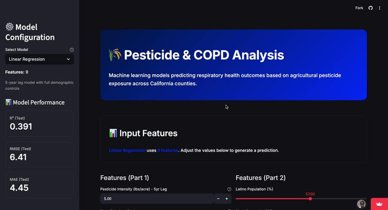

# Hey, I'm Armando 👋

I'm a double-degree student at UC Santa Cruz studying **Computer Engineering** and **Applied Mathematics**, passionate about building things that actually work — from low-level systems to full-stack web apps to machine learning pipelines.

---

## 🎓 Education

**University of California, Santa Cruz** — Expected June 2027

- 📐 B.S. Applied Mathematics — **GPA: 4.00** — Dean's Honor List
- 💻 B.S. Computer Engineering — **GPA: 3.98** — Dean's Honor List

---

## 🛠️ Projects

### 🎵 [Automated Beats – Interactive Music Generator](https://automated-beats.vercel.app/)

> React · TypeScript · Vite · Tailwind

An interactive beat-making app with animated UI, preset loops, and real-time controls. Reduced load time by 45% via asset preloading and code splitting. Users can stack/toggle tracks with <50ms audio delay and export 60-second rendered beats.

---

### 📸 [Digital Scrapbook Platform](https://www.mandoxjadyn.love/)

> React · TypeScript · Python · AWS S3 · Vercel

A production-ready multimedia web app for organizing 100+ images and videos. Features a custom SVG zig-zag timeline built with Bézier curves that adapts to content and screen size. AWS S3 lazy loading reduced initial load time by ~40%.

---

### 🌿 [Environmental Epidemiology ML Pipeline](https://ai4allenvironmentalepidemiology.streamlit.app/)

## Won AI 4 Good Award out of hundreds of teams.
> Python · Pandas · Scikit-learn · XGBoost · Streamlit

End-to-end ML pipeline analyzing 20+ years of pesticide exposure and COPD hospitalization data. Engineered 1,000+ county-year features from millions of raw records. Trained and compared Linear, Random Forest, and XGBoost models, with results visualized in an interactive Streamlit dashboard.

---

### ⚙️ Multithreaded HTTP Server
> C · POSIX Threads · Sockets

Thread-pooled HTTP/1.1 server handling 10K+ concurrent requests with sub-ms response times. Achieved 3× performance gain over baseline through optimized scheduling and request batching.

---

### 📡 Raspberry Pi Network Ad-Blocker (Pi-hole)
> Linux · DNS · Bash · Networking

Built a DNS filtering system to block ads and trackers network-wide. Configured static IP routing, DNS forwarding, and Linux services, with SSH + firewall rules for remote monitoring.

---

## 💼 Experience

**ITS Learning Technologies Consultant** — UC Santa Cruz *(Sept 2023 – Present)*
Supporting 1,000+ students, faculty, and staff across campus labs. Maintained 99%+ lab uptime and streamlined ticket workflows to cut resolution time by 15–20%.

**Founder & Full-Stack Developer** — Student Barber Booking Platform *(2022 – Present)*
Built and deployed a full-stack scheduling platform with real-time booking, SMS/email confirmations via Twilio and Nodemailer — reducing no-shows by 30% across 200+ annual appointments.

**Peer Navigator / Teaching Assistant** — UC Santa Cruz *(Jun – Sept 2024)*
Mentored 50+ first-year CS students in intro programming and calculus. Led weekly study sessions that improved average performance by 10–15%.

---

## 🧰 Tech Stack

**Languages:** Python · C · C++ · Java · SQL · Verilog · MATLAB · TypeScript

**Frameworks/Libraries:** React · Node.js · Express · Vite · NumPy · Pandas · Scikit-learn · TensorFlow

**Tools/Platforms:** AWS (EC2, Lambda, S3) · Docker · Git/GitHub · Linux · Xilinx Vivado · VS Code · Google Colab

---

## 🏆 Leadership & Honors

- Tau Beta Pi Engineering Honor Society
- ColorStack · Minority Leaders in Tech · AI4ALL Ignite
- EOP & MESA affiliate — first-generation college student and advocate
- Vince Wesson Scholar Athlete ($5,000 award)
- 3× Wrestling Captain · Valedictorian
- Formula Slug — engineering design & data analysis

---

📬 **mandoschool1@gmail.com** · [LinkedIn](https://www.linkedin.com/in/armando-tamayo-518519335/) · [GitHub](https://github.com/MandoBug)
