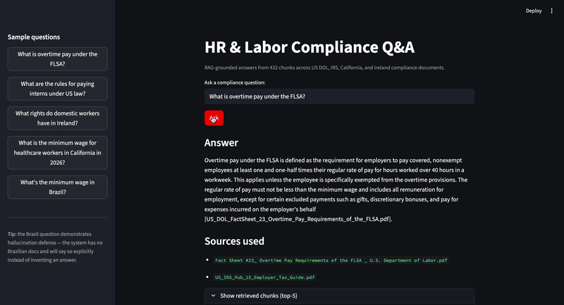
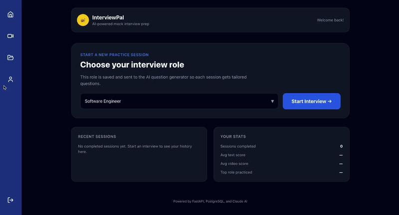
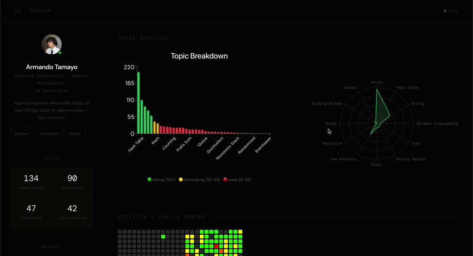
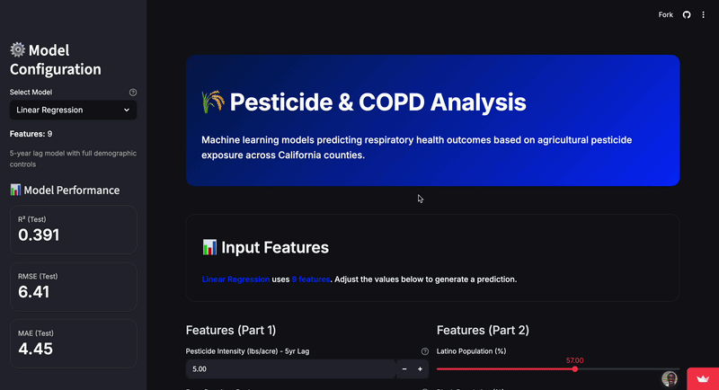
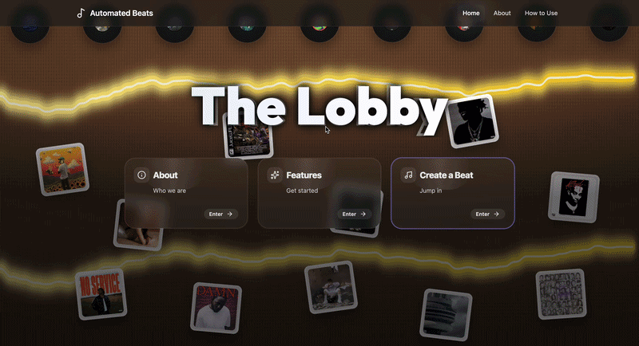
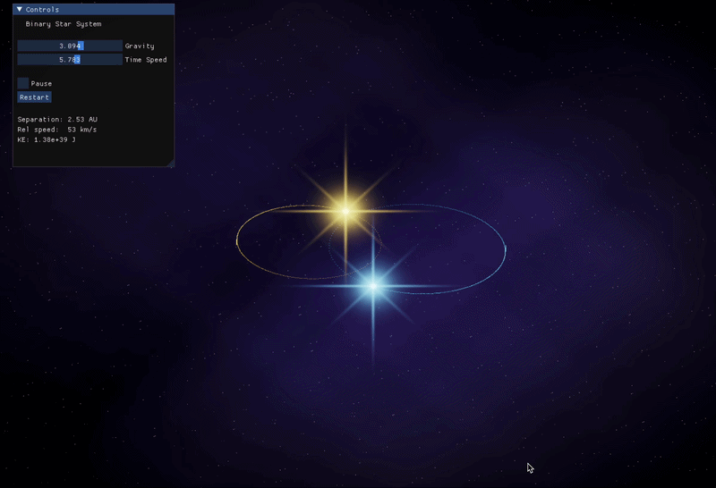

# Hey, I'm Armando 👋

I'm a double-degree student at UC Santa Cruz (**Computer Engineering** + **Applied Mathematics**) who likes building things end to end — data platforms and ML pipelines, full-stack production apps, and the low-level systems underneath. Lately I'm focused on **data engineering and applied AI**: shipping LLM-powered tools, RAG systems, and real-time data pipelines.

> 🚀 **Incoming Data Platform Product Intern @ G-P (Globalization Partners)** — building internal data tooling and GenAI prototypes on Databricks / Unity Catalog.

---

## 🎓 Education

**University of California, Santa Cruz** — Expected June 2027

- 📐 B.S. Applied Mathematics — **GPA: 4.00** — Dean's Honor List (3 yrs)
- 💻 B.S. Computer Engineering — **GPA: 3.99** — Dean's Honor List (3 yrs)

---

## 💼 Experience

**Data Platform Product Intern** — G-P (Globalization Partners) *(June 2026 – Present · Remote)*
Building internal data tools and GenAI prototypes on Databricks / Unity Catalog — Python services that monitor data freshness and pipeline health, integrating OpenAI/LLM APIs into internal data workflows.

**Data Engineering Fellow** — Databricks Fellowship *(Aug 2025 – March 2026 · Remote)*
Completed a competitive 20-week data engineering fellowship (Python, NLP, applied ML, pipelines). Built NLP workflows and supervised models (Linear Regression, XGBoost) with tuning and cross-validation, and delivered a 5-person capstone recognized among 200+ teams.

**Founder & Full-Stack Developer** — Student Barber Booking Platform *(2022 – Present)*
Built and deployed a full-stack scheduling platform with real-time booking and Twilio/Nodemailer confirmations — cut no-shows by 30% across 200+ annual appointments.

**Baskin Engineering Tutor** — UC Santa Cruz *(Feb 2026 – Present)*
Tutor 200+ students in Signals & Systems and Data Structures & Algorithms through whiteboard sessions and live code demos; attendees averaged an A.

**ITS Learning Technologies Consultant** — UC Santa Cruz *(Sept 2023 – Present)*
Support 1,000+ students, faculty, and staff across campus labs, maintaining 99%+ uptime and cutting ticket resolution time by 15–20%.

---

## 🛠️ Featured Projects

### 🤖 [G-P RAG Demo — Compliance Q&A](https://github.com/MandoBug/gp-rag-demo)

> Python · ChromaDB · OpenAI · RAG · Streamlit

A retrieval-augmented Q&A system over 11 HR/labor-compliance documents (~213K tokens, 432 chunks), built to mirror the architecture behind G-P's compliance assistant, Gia. Grounds every `gpt-4o-mini` answer in the top-5 retrieved chunks with source citations and an enforced "I don't know" guardrail — killing hallucination in a domain where a wrong answer is real legal liability. *(Built while prepping for my G-P interview — and it helped me land the offer.)*

---

### 🎤 [InterviewPal — AI Mock Interview Platform](https://interview-pal-omega.vercel.app)

> Next.js · TypeScript · FastAPI · PostgreSQL · Redis · Claude API · Docker

Led a 5-person Agile team as **Product Owner** across 4 sprints to ship a full-stack interview-prep app. Generates role-specific questions via the Claude API and returns per-answer feedback (score, strengths, filler-word detection), with browser video recording (MediaRecorder + IndexedDB) on a JWT-secured FastAPI backend. [GitHub →](https://github.com/MandoBug/InterviewPal)

---

### 💅 [Jadybaby Nails — Production Booking Platform](https://jadybabynails.com)

> FastAPI · React · TypeScript · PostgreSQL · Stripe · Cloudinary · Google Calendar API

A full-stack booking and studio-management app running **in production** for a real nail artist. Clients pay a Stripe deposit to *request* a slot; the artist confirms, reschedules, or declines from a private dashboard — backed by signature-verified webhooks, synchronous refunds, signed direct-to-Cloudinary uploads, and Google Calendar OAuth sync.  🔒 *Private repo (production app)*

---

### 📊 [LC Tracker — LeetCode Analytics Dashboard](https://lcdashboard.live)

> Python · FastAPI · PostgreSQL · Redis · React · Recharts · Machine Learning

A real-time analytics dashboard with a GraphQL poller, Redis message queue, and ML recommendation engine. Tracks submissions automatically, surfaces weak topics via weighted scoring, and suggests what to practice next using Laplace smoothing and log-scale recency decay. [GitHub →](https://github.com/MandoBug/leetcode-tracker)

---

### 🌿 [Environmental Epidemiology ML Pipeline](https://ai4allenvironmentalepidemiology.streamlit.app/)

> Python · Pandas · Scikit-learn · XGBoost · Streamlit — **🏆 AI 4 Good Award (200+ teams)**

End-to-end ML pipeline analyzing 20+ years of pesticide exposure and COPD hospitalization data. Engineered 1,000+ county-year features from millions of raw records, then trained and compared Linear, Random Forest, and XGBoost models in an interactive Streamlit dashboard.

---

### ⚙️ Multithreaded HTTP Server
> C · POSIX Threads · Sockets

Thread-pooled HTTP/1.1 server handling 10K+ concurrent requests at sub-ms response times. Achieved a 3× performance gain over baseline through optimized scheduling, request batching, and aggressive buffer reuse.

---

<b>📂 More projects</b>

 

### 🎵 [Automated Beats — Interactive Music Generator](https://automated-beats.vercel.app/)

> React · TypeScript · Vite · Tailwind

An interactive beat-making app with animated UI, preset loops, and real-time controls. Cut load time 45% via asset preloading and code splitting; users stack/toggle tracks with <50ms audio delay and export 60-second rendered beats.

### 📸 [Digital Scrapbook Platform](https://www.mandoxjadyn.love/)

> React · TypeScript · Python · AWS S3 · Vercel

A production multimedia web app for organizing 100+ images and videos, featuring a custom SVG zig-zag timeline built with Bézier curves. AWS S3 lazy loading cut initial load time ~40%.

### 🌟 [Binary Star System — Orbital Mechanics Simulation](https://github.com/MandoBug/BinaryStar)

> Python · Taichi · NumPy

A real-time binary star orbital simulation with GPU-rendered glows, trails, and a procedural nebula background.

### 📡 Raspberry Pi Network Ad-Blocker (Pi-hole)
> Linux · DNS · Bash · Networking

A network-wide DNS filtering system blocking ads and trackers. Configured static IP routing, DNS forwarding, and Linux services with SSH + firewall rules for remote monitoring.

---

## 🧰 Tech Stack

**Languages:** Python · SQL · C · C++ · Java · TypeScript · MATLAB · Verilog

**Frameworks & Libraries:** React · Next.js · Node.js · Express · FastAPI · NumPy · Pandas · Scikit-learn · XGBoost · TensorFlow

**Data & AI:** PostgreSQL · Redis · ChromaDB · Databricks · Unity Catalog · OpenAI / Claude APIs · RAG

**Tools & Platforms:** AWS (EC2 · Lambda · S3) · Docker · Stripe · Git/GitHub · Vercel · Railway · Linux

---

## 🏆 Leadership & Honors

- Tau Beta Pi Engineering Honor Society
- ColorStack · Minority Leaders in Tech · AI4ALL Ignite
- EOP & MESA affiliate — first-generation college student and advocate
- AI 4 Good Award Winner
- Vince Wesson Scholar Athlete ($5,000 award)
- 3× Wrestling Captain · Valedictorian

---

📬 **mandoschool1@gmail.com** · [LinkedIn](https://www.linkedin.com/in/armando-tamayo-518519335/) · [GitHub](https://github.com/MandoBug)